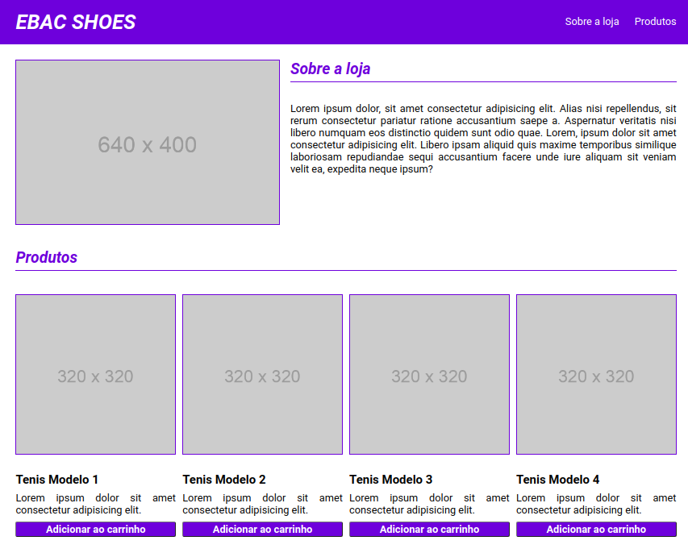

<h1 align="center">
    <a href="#" alt="...">EBAC SHOES</a>
</h1>

<h3 align="center">

    EBAC Shoes é uma página web que representa uma loja calçados online.

</h3>

  
  
  
   
   
  

<h4 align="center">
	🚧 STATUS: Projeto não finalizado 🚧
</h4>

## 💻 Sobre o projeto

**EBAC Shoes** foi um projeto desenvolvido no curso **Engenheiro Front-End** da escola **EBAC**.

Nele, foi criado uma página web que representasse a página de uma loja de venda de calçados. 
Para isso, foi utilizado apenas **HTML** e **CSS** na criação desta página. 
O maior intuíto do projeto foi treinar a responsividade das páginas web, utilizando **media queries** do CSS.

## ⚙️ Estrutura do projeto

- O projeto é composto por:
  - Página web principal: **main.html**
    - **Header**: Possui o título principal e também um menu para navegar entre as seções da página.
    - **Body**: Possui as seções da página. Cada seção possui uma construção diferente da outra. 
  - Diretório **Styles** que contém os arquivos de estilização:
    - **reset.css**: Arquivo que contém o reset da estilização aplicada por cada navegador web.
    - **index.css**: Estilzação da página web principal.
  - Uma pasta **(assets)** com as imagens utilizadas no projeto.

## 🎲 Funcionalidades

As funcionalidades desenvolvidas no projeto foram:

- [x] **Layout responsivo**: A página se adapta a diferentes tamanhos de tela, garantindo uma experiência consistente em dispositivos móveis, tablets e desktops. Isso é alcançado através do uso de media queries para ajustar o layout e os estilos conforme a largura da tela.

- [x] **Navegação do Menu**: O menu de navegação permite que os usuários acessem facilmente diferentes seções da página. Os itens do menu são apresentados de forma limpa e organizada.

- [x] **Sobre a Loja**: Esta seção fornece informações sobre a loja, incluindo uma breve descrição e uma imagem representativa. O conteúdo é apresentado de forma clara e atraente, permitindo que os visitantes compreendam rapidamente do que se trata a loja.

- [x] **Produtos**: A página exibe uma seleção de produtos. Cada produto é apresentado com uma imagem, título, breve descrição e um botão para adicionar ao carrinho. Isso permite que os usuários naveguem pelos produtos oferecidos pela loja e tomem decisões de compra informadas.

- [x] **Adicionar ao Carrinho**: Cada produto possui um botão **Adicionar ao carrinho**, permitindo que os usuários facilmente selecionem itens para compra. Esta funcionalidade é fundamental para facilitar o processo de compra e aumentar a conversão de vendas.

- [x] **Estilo de Fonte Personalizado**: A página utiliza a fonte "Roboto" do Google Fonts para garantir uma aparência consistente e legível em todos os dispositivos.

- [x] **Estilo de Botão Interativo**: Os botões de adicionar ao carrinho possuem um estilo interativo que muda quando o usuário passa o mouse sobre eles, indicando visualmente que são clicáveis.

- [x] **Estilo Visual Atraente**: O design da página é moderno e atraente, com o uso de cores e tipografia consistentes. Elementos como bordas e sombras são utilizados para fornecer destaque e ênfase aos diferentes elementos da página.Estilo Visual Atraente: O design da página é moderno e atraente, com o uso de cores e tipografia consistentes. Elementos como bordas e sombras são utilizados para fornecer destaque e ênfase aos diferentes elementos da página.

## 🛠 Tecnologias

Foi utilizado na construção do projeto as seguintes tecnologias:

<code></code> **HTML**
<code></code> **CSS**
<code></code> **Git**
<code></code> **GitHub**

## ✈️ Acesse a Página

Este projeto encontra-se hospedado na plataforma da [Vercel](https://vercel.com/).

#### Pode ser visualizado clicando aqui: [EBAC Shoes - A sua loja de calçados.](https://exercicio-responsividade-psi.vercel.app/)

## 👀 Visualizando a Página

Abaixo é possível visualizar a página web desenvolvida:

## 🦸 Autor

<a href="https://github.com/bcadore">
    
     
    <b>Bernardo Cadore Ramires</b>
</a>

 

## 📝 Licença

Este projeto esta sobe a licença [MIT](./LICENSE).

## ⚠️ Outras considerações

👉 **Este projeto é parte de uma tarefa educacional, mas sinta-se à vontade para fornecer feedback ou sugestões de melhorias.**

 

❤️  <b>MUITO OBRIGADO</b> por visitar o meu projeto! ❤️

---